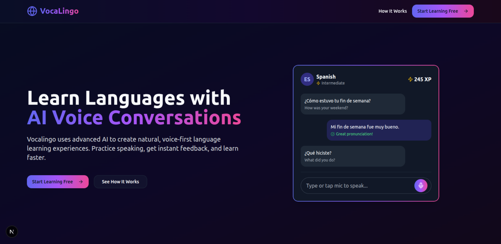

# Vocalingo 🎤🌍

## Preview



Vocalingo is a voice-powered, AI-based interactive language tutor. It helps users learn new languages through vocabulary quizzes, real-time pronunciation feedback, and AI-powered conversational practice.

## ✨ Features

- Multilingual vocabulary quizzes
- Real-time pronunciation feedback using AI
- Voice-based chatbot tutor (powered by Vapi + GPT)
- Progress tracking and gamification
- Clean, responsive UI built with TailwindCSS and Next.js

## 🛠 Tech Stack

- Frontend: Next.js, TailwindCSS, TypeScript, Vapi SDK
- Backend: Node.js / Next.js API Routes, MongoDB, OpenAI, Whisper
- Tools: Vercel

## 🚀 Getting Started

### 1. Clone the Repo

```bash
git clone https://github.com/afuhflynn/voca-lingo.git
cd voca-lingo
```

### 2. Install Dependencies

```bash
npm install or pnpm install
```

### 3. Setup Environment Variables

Create a ```.env``` file:

```bash
# Examples of even variables required
GOOGLE_GEMINI_API_KEY=
MONGODB_URI=
VAPI_API_KEY=
```

### 4. Run the App

```bash
npm run dev or pnpm dev
```

### 5. Build for Production

```bash
npm run build or pnpm build
```
